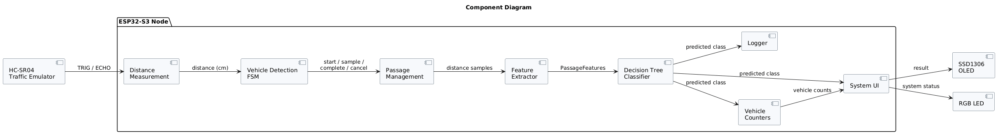
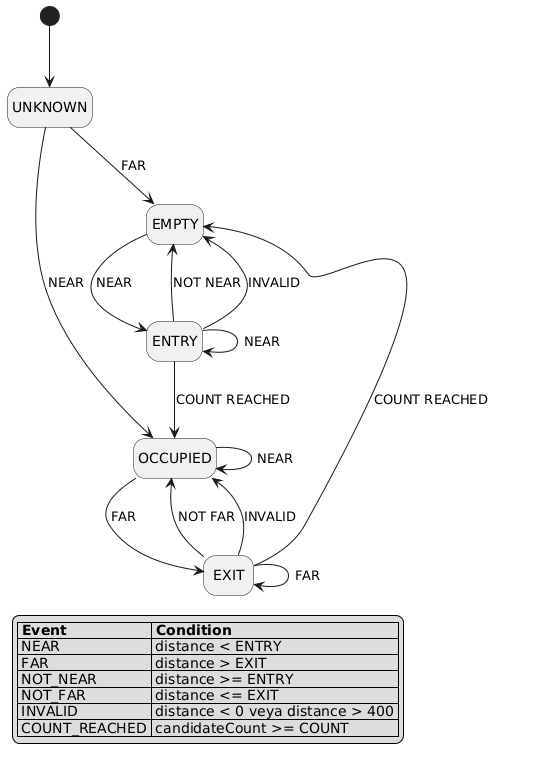

# Smart Traffic Analysis Node

An embedded traffic analysis system built with an **ESP32-S3** and an **HC-SR04 ultrasonic sensor**.

The system detects vehicle passages from ultrasonic distance measurements, extracts statistical features from each passage, and classifies the detected vehicle as:

- **CAR**
- **MOTORCYCLE**
- **TRUCK**

Vehicle classification is performed directly on the ESP32 using a trained **Decision Tree** model.

The complete system is developed and evaluated in the **Wokwi simulation environment**, including a custom HC-SR04 traffic emulator, an OLED display, an RGB status LED, and simulation-only ground-truth signals for final evaluation.

---

## 1. Project Overview

The goal of this project is to develop a compact smart traffic analysis node capable of:

- Detecting vehicle passages using an ultrasonic sensor
- Filtering unstable detections using a Finite State Machine
- Collecting distance samples during each passage
- Extracting statistical passage features
- Classifying vehicles using an embedded machine learning model
- Displaying system status and classification results
- Evaluating the complete system in simulation

The project combines embedded systems, signal processing, finite-state-machine design, data collection, machine learning, and model deployment on a microcontroller.

---

## 2. System Features

The final system provides:

- HC-SR04 ultrasonic distance measurement
- Finite State Machine based vehicle detection
- Entry and exit confirmation
- Passage lifecycle management
- Statistical feature extraction
- Decision Tree vehicle classification
- Three vehicle classes
- OLED status display
- RGB LED status indication
- Vehicle counters
- Serial evaluation logging
- Automatic traffic simulation
- Simulation-only ground-truth validation
- Non-blocking main loop operation

---

## 3. Hardware Components

| Component | Purpose |
|---|---|
| ESP32-S3 | Main processing unit |
| HC-SR04 | Ultrasonic distance measurement |
| SSD1306 OLED | System status and classification display |
| RGB LED | Visual system status indication |
| 3 × 220 Ω Resistors | RGB LED current limiting |

### Pin Configuration

| Function | ESP32-S3 GPIO |
|---|---:|
| HC-SR04 TRIG | GPIO 5 |
| HC-SR04 ECHO | GPIO 7 |
| OLED SDA | GPIO 8 |
| OLED SCL | GPIO 9 |
| Ground Truth LABEL0 | GPIO 10 |
| Ground Truth LABEL1 | GPIO 11 |
| RGB Red | GPIO 12 |
| RGB Green | GPIO 13 |
| RGB Blue | GPIO 14 |

> `LABEL0` and `LABEL1` are simulation-only signals generated by the custom traffic emulator. They are used exclusively for evaluation and are **not inputs to the machine learning model**.

---

## 4. System Architecture

The complete processing pipeline is:

```text
                         SMART TRAFFIC ANALYSIS NODE

┌───────────────────┐
│ HC-SR04 Emulator  │
│   Distance Data   │
└─────────┬─────────┘
          │ TRIG / ECHO
          ▼
┌───────────────────┐
│ Distance          │
│ Measurement       │
└─────────┬─────────┘
          │ distance (cm)
          ▼
┌───────────────────┐
│ Finite State      │
│ Machine (FSM)     │
└─────────┬─────────┘
          │ detected passage
          ▼
┌───────────────────┐
│ Passage           │
│ Management        │
└─────────┬─────────┘
          │ samples
          ▼
┌───────────────────┐
│ FeatureExtractor  │
└─────────┬─────────┘
          │
          │ 8 passage features
          ▼
┌───────────────────┐
│ Decision Tree     │
│ Classifier        │
└─────────┬─────────┘
          │
          │ CAR / MOTORCYCLE / TRUCK
          ▼
┌─────────────────────────────────────────┐
│              System Output              │
├─────────────┬─────────────┬─────────────┤
│ OLED        │ RGB LED     │ Logger      │
│ Display     │ Status      │ Evaluation  │
└─────────────┴─────────────┴─────────────┘
```

Ground truth follows a separate evaluation path:

```text
HC-SR04 Traffic Emulator
          │
          └── LABEL0 / LABEL1 ──► Ground Truth
                                         │
                                         ▼
Model Prediction ───────────────────► Evaluation Logger
```

This separation ensures that the ground-truth information cannot influence vehicle classification.

### Component Diagram

The detailed UML component diagram is available below:



---

## 5. Vehicle Detection with FSM

Vehicle detection is controlled using a Finite State Machine instead of relying on a single distance measurement.

The FSM contains five states:

```text
UNKNOWN
EMPTY
ENTRY
OCCUPIED
EXIT
```

The normal passage sequence is:

```text
UNKNOWN → EMPTY → ENTRY → OCCUPIED → EXIT → EMPTY
```

Two distance thresholds are used:

```text
Entry threshold = 100 cm
Exit threshold  = 120 cm
```

The difference between the two thresholds creates **hysteresis**, preventing unstable transitions when measurements are close to the detection boundary.

The system also requires **three consecutive measurements** to confirm entry and exit transitions.

### State Description

**UNKNOWN**

Initial system state. It prevents an object already present during startup from being incorrectly counted as a new vehicle.

**EMPTY**

The road is considered clear and the system waits for a vehicle.

**ENTRY**

A possible vehicle entry has been detected. Multiple consecutive measurements are required before confirming the vehicle.

**OCCUPIED**

A vehicle is currently passing through the sensing area. Valid passage samples are collected.

**EXIT**

The vehicle appears to have left the sensing area. Multiple consecutive measurements are required before completing the passage.

### FSM Diagram

The detailed UML state-machine diagram is available below:



---

## 6. Passage Processing

Each detected vehicle is represented by a `Passage` object.

The `Passage` class manages the lifecycle of a detected vehicle passage and encapsulates the associated feature extraction process.

Its main responsibilities include:

- Starting a new passage
- Storing the passage ID and start time
- Accepting valid distance samples
- Managing the `FeatureExtractor`
- Completing feature extraction
- Cancelling invalid passages
- Tracking whether a passage is currently active

This keeps passage-related logic separate from the main FSM and improves the modularity of the firmware.

The main application remains responsible for system-level operations such as:

- FSM transitions
- Machine learning inference
- Ground-truth evaluation
- Vehicle counters
- OLED updates
- RGB LED updates
- Serial logging

---

## 7. Feature Extraction

During a confirmed vehicle passage, distance samples are collected and converted into eight numerical features.

| Feature | Description |
|---|---|
| `duration_ms` | Duration of the detected passage |
| `min_cm` | Minimum measured distance |
| `max_cm` | Maximum measured distance |
| `mean_cm` | Mean distance |
| `std_cm` | Population standard deviation |
| `range_cm` | Difference between maximum and minimum distance |
| `mean_delta_cm` | Mean absolute difference between consecutive samples |
| `valid_samples` | Number of valid passage samples |

These features provide a compact numerical representation of the distance profile produced by a passing vehicle.

The resulting feature vector is passed directly to the embedded Decision Tree classifier.

---

## 8. Dataset Generation

Training data was generated using simulated vehicle passages.

Three vehicle classes were collected:

- Car
- Motorcycle
- Truck

The final dataset contains:

| Vehicle Class | Samples |
|---|---:|
| Motorcycle | 67 |
| Car | 64 |
| Truck | 60 |
| **Total** | **191** |

Multiple simulation runs were used for each class to introduce variation into the generated samples.

Raw passage logs were processed using the dataset generation scripts located in the `scripts/` directory.

The generated dataset contains the eight extracted features together with the corresponding vehicle label.

---
## 9. Machine Learning Model

Two supervised machine learning algorithms were evaluated during development:

- Decision Tree
- Random Forest

Both models were trained using the same eight passage features and evaluated using the same dataset preparation strategy.

### 9.1 Decision Tree

The Decision Tree achieved the following final test result:

```text
Test samples : 39
Correct      : 37
Incorrect    : 2
Test accuracy: 94.87%
```

The test confusion matrix was:

```text
                 Predicted
               CAR   MOTORCYCLE   TRUCK

Actual CAR      13       0          0
Actual MOTO      0      14          0
Actual TRUCK     2       0         10
```

The two classification errors were truck samples classified as cars.

### 9.2 Random Forest Comparison

A Random Forest classifier was also trained and evaluated as an alternative model.

During cross-validation, Random Forest showed competitive performance and achieved a slightly higher mean cross-validation score than the Decision Tree. However, its final held-out test performance was lower.

| Model | Final Test Accuracy |
|---|---:|
| Decision Tree | **94.87%** |
| Random Forest | **89.74%** |

The Random Forest correctly classified 35 of the 39 final test samples, while the Decision Tree correctly classified 37.

The difference should be interpreted carefully because the final test set contains only 39 samples. The result does not imply that Decision Trees are generally superior to Random Forests.

### 9.3 Model Selection

The **Decision Tree** was selected for deployment on the ESP32-S3.

The main reasons were:

- Higher accuracy on the final held-out test set
- Simpler model structure
- Lower memory and computational requirements
- Fast inference on a microcontroller
- High interpretability
- Straightforward conversion into C++ decision logic

The Decision Tree can be represented as a small sequence of conditional branches, making it particularly suitable for direct embedded deployment.

Random Forest remained a competitive alternative during development, but its additional complexity did not provide better performance on the final test set used in this project.

### 9.4 Feature Importance

The most influential features in the final Decision Tree were:

| Feature | Importance |
|---|---:|
| `min_cm` | 0.4969 |
| `mean_cm` | 0.4706 |
| `std_cm` | 0.0193 |
| `range_cm` | 0.0132 |

The remaining features had zero importance in the final trained tree.

---

## 10. ESP32 Integration

The trained Decision Tree was converted into C++ decision logic and integrated directly into the ESP32 firmware.

The embedded inference pipeline is:

```text
Distance Samples
      │
      ▼
FeatureExtractor
      │
      ▼
PassageFeatures
      │
      ▼
Decision Tree
      │
      ▼
VehicleClass
```

The available output classes are:

```cpp
CAR
MOTORCYCLE
TRUCK
```

No Python runtime or external machine learning framework is required on the ESP32 during inference.

Once deployed, classification is performed entirely by the microcontroller.

---

## 11. User Interface

### 11.1 OLED Display

An SSD1306 OLED display provides real-time system feedback.

The display shows:

- Current system status
- Last classified vehicle
- Total detected vehicle count
- Car count
- Motorcycle count
- Truck count

Example:

```text
SMART TRAFFIC NODE
------------------
Status: CLASSIFIED
Vehicle: CAR
Total: 30
C:10 M:10 T:10
```

The displayed class counters represent **model predictions**.

### 11.2 RGB LED

A common-cathode RGB LED provides visual status feedback.

| System State | LED |
|---|---|
| READY | Green |
| DETECTING | Blue |
| CLASSIFIED | Yellow |
| ERROR | Red |

The OLED and RGB LED are controlled through the `SystemUI` module.

The final firmware uses non-blocking timing for the classification display so that UI feedback does not stop the sensor-processing loop.

---

## 12. Simulation Environment

The complete system was developed and evaluated using **Wokwi**.

### 12.1 Wokwi

The simulation contains:

- ESP32-S3
- Custom HC-SR04 emulator
- SSD1306 OLED
- RGB LED
- Ground-truth evaluation signals

The ESP32 communicates with the custom ultrasonic emulator using the same TRIG/ECHO mechanism used by an HC-SR04 sensor.

This allows the firmware to operate through the complete sensor interface rather than receiving synthetic distance values directly inside the ESP32 code.

### 12.2 HC-SR04 Traffic Emulator

A custom Wokwi chip was developed to generate automatic traffic scenarios.

The emulator generates distance profiles representing:

- Motorcycle
- Car
- Truck

Variation is introduced into the generated profiles so that every vehicle of the same class does not produce an identical passage.

In automatic traffic mode, vehicle classes are generated in a balanced sequence with shuffled ordering.

### 12.3 Ground Truth Labels

The custom emulator provides two additional simulation-only outputs:

```text
LABEL1 LABEL0   CLASS

   0      0     MOTORCYCLE
   0      1     CAR
   1      0     TRUCK
   1      1     INVALID
```

These pins are read only after the machine learning prediction has been generated.

They are used exclusively to compare:

```text
Actual Vehicle ↔ Predicted Vehicle
```

They do not participate in:

- Vehicle detection
- Feature extraction
- Decision Tree inference
- Vehicle classification

---

## 13. Final System Evaluation

A final end-to-end simulation test was performed using **30 automatically generated vehicle passages**.

The test evaluated the complete pipeline:

```text
HC-SR04 Emulator
      ↓
Distance Measurement
      ↓
FSM
      ↓
Passage Management
      ↓
Feature Extraction
      ↓
Decision Tree Inference
      ↓
OLED / RGB / Logger
```

### Results

| Metric | Result |
|---|---:|
| Processed vehicles | 30 / 30 |
| Correct classifications | 26 |
| Incorrect classifications | 4 |
| End-to-end accuracy | **86.67%** |
| Runtime errors | **0** |
| Missing passage IDs | **0** |
| Duplicate passage IDs | **0** |

The ground-truth test distribution was perfectly balanced:

```text
CAR        : 10
MOTORCYCLE : 10
TRUCK      : 10
```

### Class-wise Results

| Vehicle Class | Correct | Total | Accuracy |
|---|---:|---:|---:|
| Car | 9 | 10 | **90%** |
| Motorcycle | 10 | 10 | **100%** |
| Truck | 7 | 10 | **70%** |

The four incorrect classifications were:

```text
TRUCK → CAR
CAR   → TRUCK
TRUCK → CAR
TRUCK → CAR
```

The final test therefore shows that motorcycle passages were clearly separated by the current model, while the main classification ambiguity occurred between cars and trucks.

The continuous passage IDs from `1` to `30`, together with zero runtime errors, also indicate that all generated passages were processed during this simulation run.

### Offline Model Evaluation vs. End-to-End Evaluation

Two different accuracy values are reported in this project:

```text
Decision Tree offline test accuracy : 94.87%
End-to-end simulation accuracy      : 86.67%
```

These values represent different experiments.

The **94.87%** result measures the Decision Tree against the held-out dataset test set.

The **86.67%** result measures the complete simulated embedded pipeline, including ultrasonic measurement, FSM processing, passage sampling, feature extraction, and ESP32 inference.

Therefore, the two values should not be interpreted as results from the same evaluation procedure.

---

## 14. Project Structure

```text
smart_traffic_analysis_node/
│
├── chips/
│   ├── hc-sr04-emulator.c
│   ├── hc-sr04-emulator.chip.json
│   ├── hc-sr04-emulator.chip.wasm
│   └── wokwi-api.h
│
├── datasets/
│
├── diagrams/
│   ├── component-diagram.png
│   └── fsm-diagram.png
│
├── include/
│   ├── DecisionTreeModel.h
│   ├── FeatureExtractor.h
│   ├── Logger.h
│   ├── Passage.h
│   └── SystemUI.h
│
├── logs/
│
├── models/
│   └── decision_tree.joblib
│
├── scripts/
│   ├── create_dataset.py
│   ├── train_dt.py
│   ├── train_rf.py
│   ├── export_model.py
│   └── verify_deployment.py
│
├── src/
│   ├── FeatureExtractor.cpp
│   ├── Logger.cpp
│   ├── Passage.cpp
│   ├── SystemUI.cpp
│   └── main.cpp
│
├── diagram.json
├── platformio.ini
├── README.md
├── requirements.txt
├── wokwi.toml
└── .gitignore
```

---

## 15. How to Run

### Requirements

The project requires:

- Visual Studio Code
- PlatformIO
- Wokwi for VS Code
- Python
- Required Python packages from `requirements.txt`

### Install Python Dependencies

From the project root:

```bash
python -m pip install -r requirements.txt
```

### Build the ESP32 Firmware

Using PlatformIO:

```bash
pio run
```

or use the PlatformIO **Build** command in Visual Studio Code.

### Compile the Custom Wokwi Chip

The HC-SR04 emulator can be compiled using the Wokwi CLI:

```bash
wokwi-cli chip compile chips/hc-sr04-emulator.c -o chips/hc-sr04-emulator.chip.wasm
```

### Start the Simulation

1. Build the ESP32 firmware.
2. Compile the custom HC-SR04 emulator if its source code was modified.
3. Start the Wokwi simulation from Visual Studio Code.
4. Enable automatic traffic generation in the HC-SR04 emulator.
5. Open the Serial Monitor.
6. Observe the OLED, RGB LED, and classification output.

Example Serial output:

```text
[SYSTEM] Smart Traffic Node ready
[VEHICLE] #1 | actual=CAR | predicted=CAR | CORRECT
[VEHICLE] #2 | actual=MOTORCYCLE | predicted=MOTORCYCLE | CORRECT
[VEHICLE] #3 | actual=TRUCK | predicted=TRUCK | CORRECT
```

---

## 16. Limitations

### Simulation-Based Dataset

The current dataset was generated from simulated vehicle profiles.

As a result, the reported classification accuracy represents performance within the current simulation environment and must **not** be interpreted as real-world traffic classification accuracy.

Real-world deployment would require:

- Physical sensor measurements
- Real vehicle passages
- Environmental variation
- Sensor noise analysis
- A real-world training dataset
- Independent validation under different traffic conditions

### Single Ultrasonic Sensor

The system currently uses one HC-SR04 sensor.

A single measurement point cannot independently determine both vehicle speed and physical vehicle length.

Passage duration is influenced by both:

```text
Passage Duration ≈ Vehicle Length / Vehicle Speed
```

Therefore, passage duration alone should not be interpreted as an independent speed or vehicle-length measurement.

### Dataset Size

The current machine learning dataset contains 191 samples.

Although sufficient for demonstrating the complete embedded ML pipeline, a significantly larger and more diverse dataset would be required for a production system.

### Simulation Profile Dependence

The vehicle profiles used by the custom emulator are intentionally class-dependent.

The machine learning model can therefore learn characteristics of these simulated profiles.

High performance in this environment does not guarantee equivalent performance against real vehicles.

---

## 17. Future Improvements

Possible future improvements include:

- Collecting data from physical HC-SR04 sensors
- Building a real-world vehicle dataset
- Increasing the number of independent data collection runs
- Testing under different vehicle speeds
- Introducing additional sensor noise and environmental variation
- Using two ultrasonic sensors for speed estimation
- Estimating vehicle length using measured speed and passage time
- Evaluating additional embedded machine learning models
- Improving car/truck separation
- Performing grouped evaluation across independent recording sessions
- Testing the system on physical ESP32-S3 hardware
- Integrating traffic statistics with a remote monitoring system

---

## Conclusion

The Smart Traffic Analysis Node demonstrates a complete embedded machine learning workflow from sensor measurement to real-time classification.

The project integrates:

```text
Ultrasonic Sensing
        +
Finite State Machine
        +
Passage Processing
        +
Feature Extraction
        +
Machine Learning
        +
ESP32 Deployment
        +
Real-Time User Interface
```

The final Wokwi implementation successfully processed all **30/30** vehicle passages in the end-to-end evaluation without runtime errors and achieved an **86.67% simulation classification accuracy**.

The system provides a modular foundation for future development using physical sensors and real-world traffic data.
